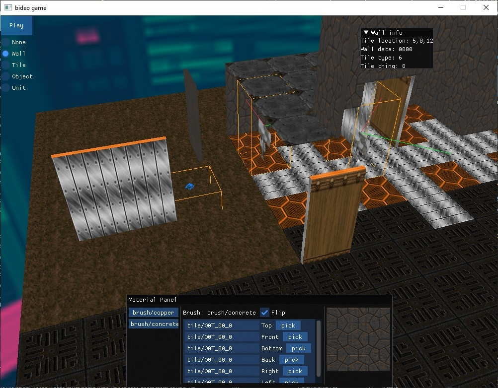

# TAC
Old, unfinished project of mine. Built with raylib-cs

~~Very bad clone of X-COM UFO Defense.~~ Honestly looking back at it, it looks surprisingly not bad. Editing facilities are there, but the UI needs work. Actual gameplay *does not* exist, but i'll fix that soon :^).

Here's my experience so far:

C# is very slick, very easy to use and profile and extend. I definetly miss all the syntax sugar and containers when I'm doing something else. I do however regret using raylib-cs since I no longer have easy access to the library source code and I'd rely on upstream. I really don't want to bother with making my own bindings and interop.

## What's left:

- [ ] Upgrade raylib-cs
- [ ] Make build process more cross-platform
- [ ] Fix camera controls, fix viewing angle, isometric maybe?
- [ ] Tighten art style, stick to billboards only
- [ ] Replace vision algo with a brute force one, you don't need the performance yet
- [ ] Make it look pretty ffs

## Images!!!!!

